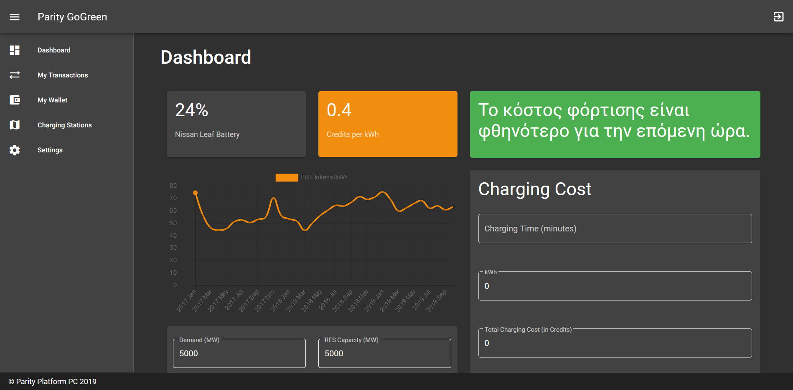
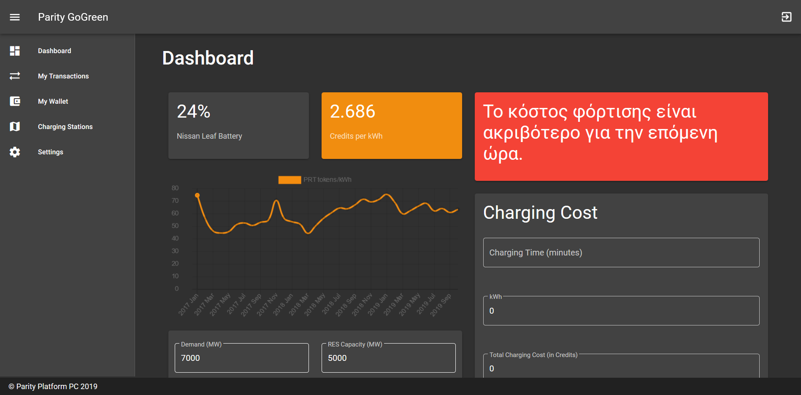
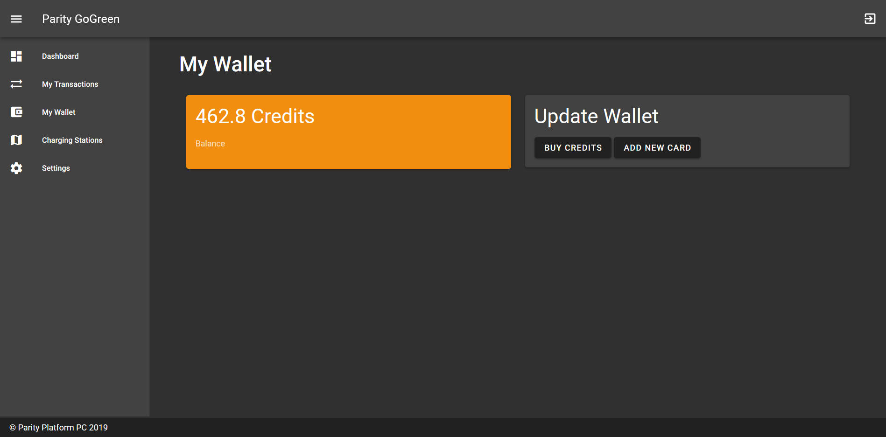
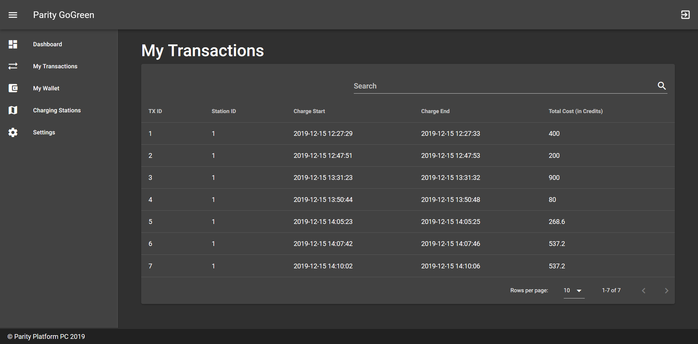
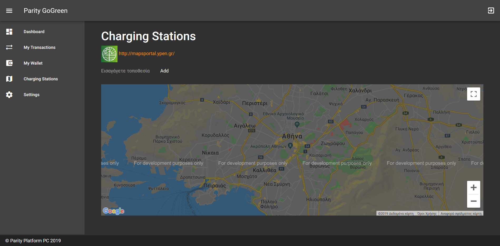

Parity Platform - GO4GREEN
==========================

<a href="https://parityplatform.com/" style="text-align: center">
    
</a>

## About


## Requirements

- PHP 7.3
- MySQL
- NodeJS & NPM
- Composer installed

## Install & Run webapp

```
composer install
npm install
```
Create a new database in MySQL and copy the name in the `.env` file. Make sure the `.env` file is created, if not copy the `.env.example` and name it `.env`, then run
```
php artisan migrate
```

## Open source technologies

- Laravel framework
- VueJS
- VuetifyJS
- ChartJS
- OCPP by [Open Charge Alliance](https://www.openchargealliance.org/)
- Raspberry Pi 2 (for the POC)

## Web Application Screenshots







## POC Hardware
