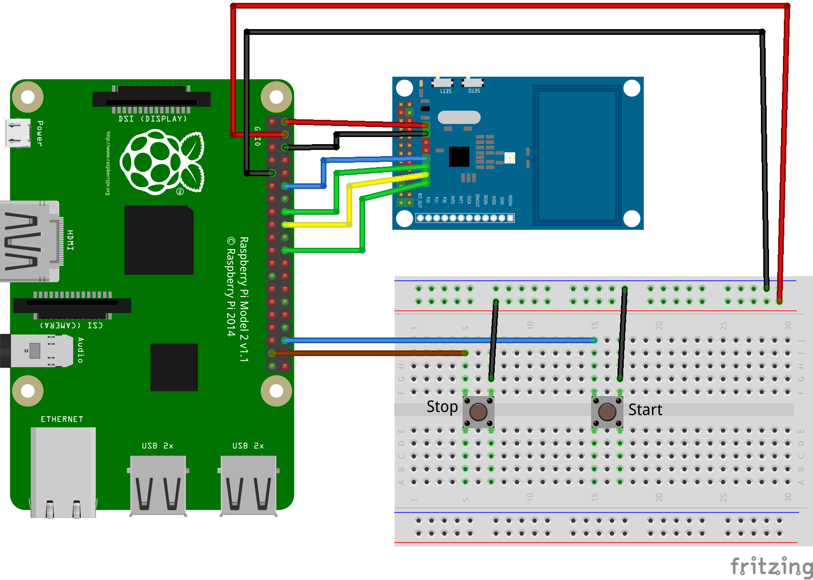

Parity Platform - GO4GREEN
==========================

<a href="https://parityplatform.com/" style="text-align: center">
    
</a>

## About
Ένα βασικό όφελος που μπορεί να προκύψει από την αύξηση του ποσοστού ηλεκτρικών οχημάτων είναι η αύξηση της αποδοτικότητας ολόκληρου του δικτύου. Καθώς το ποσοστό των ΑΠΕ στο μείγμα παραγωγής ενέργειας αυξάνεται, αυξάνεται και η πιθανότητα εμφάνισης χρονικών διαστημάτων με πλεόνασμα παραγωγής από ανανεώσιμες πηγές ενέργειας (ΑΠΕ) έναντι της ζήτησης από το δίκτυο. Σε αντίθεση με τις συμβατικές πηγές (π.χ. λιγνίτης), η παραγωγή από αιολικά και ηλιακά πάρκα δεν είναι εύκολο να συγχρονιστεί με τη ζήτηση. Χωρίς την ύπαρξη υποδομών αποθήκευσης, το πλεόνασμα ενέργειας από ΑΠΕ περικόπτεται (curtailment), δηλαδή το φωτοβολταικό σύστημα ή το αιολικό πάρκο μειώνει ή αναστέλλει την παραγωγή ενέργειας για το παραπάνω χρονικό διάστημα.
Με κατάλληλο χρονισμό των φορτίσεων ηλεκτρικών οχημάτων σε χρονικές περιόδους περίσσειας παραγωγής από ΑΠΕ αυξάνεται η αποδοτικότητα του δικτυού. Το πλεόνασμα ενέργειας αποθηκεύεται σε ηλεκτρικά οχήματα, αντί να περικόπτεται. Για την επίτευξη του κατάλληλου χρονισμού φορτίσεων των ηλεκτρικών οχημάτων απαιτείται παροχή κινήτρων προς τους οδηγούς.
Για να επιτευχθεί η παροχή των παραπάνω κινήτρων στους οδηγούς και ο κατάλληλος χρονισμός των φορτίσεων, η Parity Platform θα αναπτύξει δικτυακή εφαρμογή (web app) διαχείρισης των σταθμών φόρτισης. Οι ιδιοκτήτες οχημάτων που επιθυμούν να φορτίσουν το όχημα τους στο σταθμό φόρτισης του δικτύου:
1. Δημιουργούν το λογαριασμό τους στην δικτυακή εφαρμογή.
2. Προ-αγοράζουν tokens σε καθορισμένη τιμή
3. Χρησιμοποιούν αυτά τα tokens για να πληρώσουν για τις φορτίσεις των οχημάτων τους. Ο αριθμός των token που απαιτείται για κάθε λεπτό φόρτισης μεταβάλλεται κάθε ώρα και τείνει να μειώνεται όταν υπάρχει πλεόνασμα παραγωγής από ΑΠΕ στο δίκτυο.
Το λογισμικό θα δοκιμαστεί σε έναν προσομοιωτή σταθμού φόρτισης (hardware) και θα αξιοποιεί το πρωτόκολλο OCPP, το οποίο χρησιμοποιείται από τους περισσότερους κατασκευαστές φορτιστές της αγοράς


## Requirements

- PHP 7.3
- MySQL
- NodeJS & NPM
- Composer installed

## Install & Run webapp

```
composer install
npm install
```
Create a new database in MySQL and copy the name in the `.env` file. Make sure the `.env` file is created, if not copy the `.env.example` and name it `.env`, then run
```
php artisan migrate
```
to create the database tables. Then run `php artisan db:seed` to load some dummy data and then serve the application by running
```
php artisan serve
```

## Open source technologies

- Laravel framework
- VueJS
- VuetifyJS
- ChartJS
- OCPP by [Open Charge Alliance](https://www.openchargealliance.org/)
- Raspberry Pi 2 (for the POC)

## Web Application Screenshots


## POC Hardware
